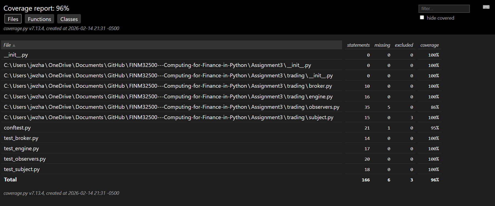

# README

## Short design notes on Observer implementation

The Subject in the design pattern was defined to be MarketDataSubject, which will receive the new market price and update in observers accordingly. 

The Observers added to the Subjects are 

(1) Strategy Observer - which is to generate the trading signal using rolling std with volatility breakout strategy

(2) Risk Observer - which is to make sure the position doesn't exceed max position

(3) Logger Observer - which is to log historical prices

## How to run test and coverage

We've used the pytest along with the MagicMock to provide fake signals and values for testing. 

To run the coverage, we used the command prompt to run the coverage code under python3 module to generate the coverage report stored under tests/htmlcov folder. 

To run the CI in Github, we've created the workflow action that runs pytest and return coverage report to make sure commit pushed will have no less than 90% coverage. 

## CI status and coverage report 

