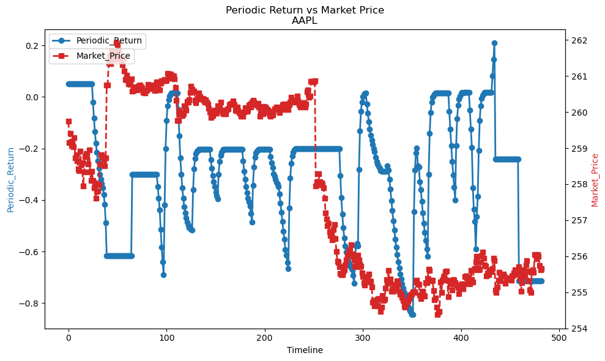

# Group1 Report

In this Algo, we implemented momentum trading strategy combined with Moving Average Crossover strategy, along with the loss stop rate to be 0.03 and risk to be 15% of current capital to control the risk.

## Multiprocessing

In this trading strategy, we've implemented 3 processes to run three symbol trading in parallel. Within each process, we run the engine per minute and store the most recent market price, ADX and RSI into local thread storage to realize multiprocessing and memory independency. 

## Momentum Strategy

In the Momentum Strategy, we used minute as trading interval and 15 days as window to calculate ADX and RSI.

## Moving Average Crossover Strategy

In Moving Average Crossover Strategy, we used 5 datapoints as slow period and 25 datapoints as fast period.

## Risk Control

In addition to the 0.03 loss stop, we've also conducted the simple average of the suggested position sizing from both Momentum strategy and Moving Average Crossover strategy to avoid skewed jump or drop from single algorithm.

# Performance Report

## Metrics Table

|   PositionQuantity |   AvgPrice |    Return |   Capital | TimeStamp                 |   MarketPrice |    return |   Absolute_Return |   Periodic_Return |
|-------------------:|-----------:|----------:|----------:|:--------------------------|--------------:|----------:|------------------:|------------------:|
|                  0 |      0     |     0     | 105201    | 2026-03-10 09:32:00-04:00 |       259.74  |     0     |           5201.33 |         0.0520133 |
|                  0 |      0     |     0     | 105201    | 2026-03-10 09:33:00-04:00 |       259.15  |     0     |           5201.33 |         0.0520133 |
|                  0 |      0     |     0     | 105201    | 2026-03-10 09:34:00-04:00 |       259.405 |     0     |           5201.33 |         0.0520133 |
|                  0 |      0     |     0     | 105201    | 2026-03-10 09:35:00-04:00 |       259.07  |     0     |           5201.33 |         0.0520133 |
|                  0 |      0     |     0     | 105201    | 2026-03-10 09:36:00-04:00 |       259.19  |     0     |           5201.33 |         0.0520133 |
|                  0 |      0     |     0     | 105201    | 2026-03-10 09:37:00-04:00 |       259.04  |     0     |           5201.33 |         0.0520133 |
|                  0 |      0     |     0     | 105201    | 2026-03-10 09:38:00-04:00 |       259.29  |     0     |           5201.33 |         0.0520133 |
|                  0 |      0     |     0     | 105201    | 2026-03-10 09:39:00-04:00 |       258.72  |     0     |           5201.33 |         0.0520133 |
|                  0 |      0     |     0     | 105201    | 2026-03-10 09:40:00-04:00 |       258.81  |     0     |           5201.33 |         0.0520133 |
|                  0 |      0     |     0     | 105201    | 2026-03-10 09:41:00-04:00 |       258.64  |     0     |           5201.33 |         0.0520133 |
|                  0 |      0     |     0     | 105201    | 2026-03-10 09:42:00-04:00 |       258.43  |     0     |           5201.33 |         0.0520133 |
|                  0 |      0     |     0     | 105201    | 2026-03-10 09:43:00-04:00 |       258.37  |     0     |           5201.33 |         0.0520133 |
|                  0 |      0     |     0     | 105201    | 2026-03-10 09:44:00-04:00 |       258.91  |     0     |           5201.33 |         0.0520133 |
|                  0 |      0     |     0     | 105201    | 2026-03-10 09:45:00-04:00 |       258.55  |     0     |           5201.33 |         0.0520133 |
|                  0 |      0     |     0     | 105201    | 2026-03-10 09:46:00-04:00 |       258.59  |     0     |           5201.33 |         0.0520133 |
|                  0 |      0     |     0     | 105201    | 2026-03-10 09:47:00-04:00 |       257.94  |     0     |           5201.33 |         0.0520133 |
|                  0 |      0     |     0     | 105201    | 2026-03-10 09:48:00-04:00 |       258.33  |     0     |           5201.33 |         0.0520133 |
|                  0 |      0     |     0     | 105201    | 2026-03-10 09:49:00-04:00 |       258.765 |     0     |           5201.33 |         0.0520133 |
|                  0 |      0     |     0     | 105201    | 2026-03-10 09:50:00-04:00 |       258.85  |     0     |           5201.33 |         0.0520133 |
|                  0 |      0     |     0     | 105201    | 2026-03-10 09:51:00-04:00 |       258.78  |     0     |           5201.33 |         0.0520133 |
|                  0 |      0     |     0     | 105201    | 2026-03-10 09:52:00-04:00 |       258.56  |     0     |           5201.33 |         0.0520133 |
|                  0 |      0     |     0     | 105201    | 2026-03-10 09:53:00-04:00 |       258.955 |     0     |           5201.33 |         0.0520133 |
|                  0 |      0     |     0     | 105201    | 2026-03-10 09:54:00-04:00 |       258.345 |     0     |           5201.33 |         0.0520133 |
|                  0 |      0     |     0     | 105201    | 2026-03-10 09:55:00-04:00 |       258.095 |     0     |           5201.33 |         0.0520133 |
|                 30 |    258.095 | -7742.85  |  97458.5  | 2026-03-10 09:56:00-04:00 |       258.355 |  7750.65  |           5209.13 |         0.0520913 |
|                 56 |    258.216 | -6717.23  |  83432.7  | 2026-03-10 09:57:00-04:00 |       258.1   | 14453.6   |          -2113.7  |        -0.021137  |
|                 78 |    258.183 | -5678.2   |  71681.5  | 2026-03-10 09:58:00-04:00 |       257.9   | 20116.2   |          -8202.33 |        -0.0820233 |
|                 97 |    258.128 | -4900.1   |  61508.2  | 2026-03-10 09:59:00-04:00 |       258.025 | 25028.4   |         -13463.4  |        -0.134634  |
|                113 |    258.113 | -4128.4   |  52924    | 2026-03-10 10:00:00-04:00 |       257.61  | 29109.9   |         -17966    |        -0.17966   |
|                127 |    258.058 | -3606.54  |  45681    | 2026-03-10 10:01:00-04:00 |       257.8   | 32740.6   |         -21578.4  |        -0.215784  |
|                139 |    258.035 | -3093.6   |  39349.3  | 2026-03-10 10:02:00-04:00 |       257.82  | 35837     |         -24813.7  |        -0.248137  |
|                149 |    258.021 | -2578.2   |  33938    | 2026-03-10 10:03:00-04:00 |       257.99  | 38440.5   |         -27621.5  |        -0.276215  |
|                158 |    258.019 | -2321.91  |  29192.2  | 2026-03-10 10:04:00-04:00 |       258.555 | 40851.7   |         -29956.1  |        -0.299561  |
|                165 |    258.042 | -1809.88  |  25356.6  | 2026-03-10 10:05:00-04:00 |       258.815 | 42704.5   |         -31939    |        -0.31939   |
|                171 |    258.069 | -1552.89  |  22184.6  | 2026-03-10 10:06:00-04:00 |       258.82  | 44258.2   |         -33557.2  |        -0.335572  |
|                 85 |    258.069 | 22258.5   |  42826.6  | 2026-03-10 10:07:00-04:00 |       258.75  | 21993.8   |         -35179.6  |        -0.351796  |
|                 42 |    258.069 | 11126.2   |  51125.7  | 2026-03-10 10:08:00-04:00 |       258.68  | 10864.6   |         -38009.8  |        -0.380098  |
|                 21 |    258.069 |  5432.28  |  52924.3  | 2026-03-10 10:09:00-04:00 |       258.5   |  5428.5   |         -41647.2  |        -0.416472  |
|                 10 |    258.069 |  2843.5   |  48508.1  | 2026-03-10 10:10:00-04:00 |       258.73  |  2587.3   |         -48904.6  |        -0.489046  |
|                  5 |    258.069 |     0     |  37158.6  | 2026-03-10 15:59:00-04:00 |       260.75  |  1303.75  |         -61537.7  |        -0.615376  |
|                  5 |    258.069 |     0     |  37158.6  | 2026-03-10 15:59:00-04:00 |       260.75  |  1303.75  |         -61537.7  |        -0.615376  |
|                  5 |    258.069 |     0     |  37158.6  | 2026-03-11 09:30:00-04:00 |       261.36  |  1306.8   |         -61534.6  |        -0.615346  |
|                  5 |    258.069 |     0     |  37158.6  | 2026-03-11 09:31:00-04:00 |       261.55  |  1307.75  |         -61533.7  |        -0.615337  |
|                  5 |    258.069 |     0     |  37158.6  | 2026-03-11 09:32:00-04:00 |       261.35  |  1306.75  |         -61534.7  |        -0.615347  |
|                  5 |    258.069 |     0     |  37158.6  | 2026-03-11 09:33:00-04:00 |       261.69  |  1308.45  |         -61533    |        -0.61533   |
|                  5 |    258.069 |     0     |  37158.6  | 2026-03-11 09:34:00-04:00 |       261.65  |  1308.25  |         -61533.2  |        -0.615332  |
|                  5 |    258.069 |     0     |  37158.6  | 2026-03-11 09:35:00-04:00 |       261.525 |  1307.62  |         -61533.8  |        -0.615338  |
|                  5 |    258.069 |     0     |  37158.6  | 2026-03-11 09:36:00-04:00 |       261.455 |  1307.27  |         -61534.1  |        -0.615341  |
|                  5 |    258.069 |     0     |  37158.6  | 2026-03-11 09:37:00-04:00 |       261.63  |  1308.15  |         -61533.2  |        -0.615332  |
|                  5 |    258.069 |     0     |  37158.6  | 2026-03-11 09:38:00-04:00 |       261.92  |  1309.6   |         -61531.8  |        -0.615318  |
|                  5 |    258.069 |     0     |  37158.6  | 2026-03-11 09:39:00-04:00 |       261.87  |  1309.35  |         -61532.1  |        -0.615321  |
|                  5 |    258.069 |     0     |  37158.6  | 2026-03-11 09:40:00-04:00 |       261.695 |  1308.47  |         -61532.9  |        -0.615329  |
|                  5 |    258.069 |     0     |  37158.6  | 2026-03-11 09:41:00-04:00 |       261.47  |  1307.35  |         -61534.1  |        -0.615341  |
|                  5 |    258.069 |     0     |  37158.6  | 2026-03-11 09:42:00-04:00 |       261.52  |  1307.6   |         -61533.8  |        -0.615338  |
|                  5 |    258.069 |     0     |  37158.6  | 2026-03-11 09:43:00-04:00 |       261.44  |  1307.2   |         -61534.2  |        -0.615342  |
|                  5 |    258.069 |     0     |  37158.6  | 2026-03-11 09:44:00-04:00 |       261.315 |  1306.58  |         -61534.8  |        -0.615348  |
|                  5 |    258.069 |     0     |  37158.6  | 2026-03-11 09:45:00-04:00 |       261.48  |  1307.4   |         -61534    |        -0.61534   |
|                  5 |    258.069 |     0     |  37158.6  | 2026-03-11 09:46:00-04:00 |       261.14  |  1305.7   |         -61535.7  |        -0.615357  |
|                  5 |    258.069 |     0     |  37158.6  | 2026-03-11 09:47:00-04:00 |       260.9   |  1304.5   |         -61536.9  |        -0.615369  |
|                  5 |    258.069 |     0     |  37158.6  | 2026-03-11 09:48:00-04:00 |       261.02  |  1305.1   |         -61536.3  |        -0.615363  |
|                  5 |    258.069 |     0     |  37158.6  | 2026-03-11 09:49:00-04:00 |       260.88  |  1304.4   |         -61537    |        -0.61537   |
|                  5 |    258.069 |     0     |  37158.6  | 2026-03-11 09:50:00-04:00 |       260.79  |  1303.95  |         -61537.5  |        -0.615375  |
|                  5 |    258.069 |     0     |  37158.6  | 2026-03-11 09:51:00-04:00 |       260.785 |  1303.93  |         -61537.5  |        -0.615375  |
|                  5 |    258.069 |     0     |  37158.6  | 2026-03-11 09:52:00-04:00 |       260.77  |  1303.85  |         -61537.6  |        -0.615376  |
|                  5 |    258.069 |     0     |  37158.6  | 2026-03-11 09:53:00-04:00 |       260.92  |  1304.6   |         -61536.8  |        -0.615368  |
|                 15 |    258.069 |     0     |  66108.6  | 2026-03-11 12:51:00-04:00 |       260.58  |  3908.7   |         -29982.7  |        -0.299827  |
|                 15 |    258.069 |     0     |  66108.6  | 2026-03-11 12:52:00-04:00 |       260.6   |  3909     |         -29982.4  |        -0.299824  |
|                 15 |    258.069 |     0     |  66108.6  | 2026-03-11 12:53:00-04:00 |       260.67  |  3910.05  |         -29981.4  |        -0.299814  |
|                 15 |    258.069 |     0     |  66108.6  | 2026-03-11 12:54:00-04:00 |       260.69  |  3910.35  |         -29981.1  |        -0.299811  |
|                 15 |    258.069 |     0     |  66108.6  | 2026-03-11 12:55:00-04:00 |       260.63  |  3909.45  |         -29982    |        -0.29982   |
|                 15 |    258.069 |     0     |  66108.6  | 2026-03-11 12:56:00-04:00 |       260.605 |  3909.08  |         -29982.3  |        -0.299823  |
|                 15 |    258.069 |     0     |  66108.6  | 2026-03-11 12:57:00-04:00 |       260.625 |  3909.38  |         -29982    |        -0.29982   |
|                 15 |    258.069 |     0     |  66108.6  | 2026-03-11 12:58:00-04:00 |       260.735 |  3911.03  |         -29980.4  |        -0.299804  |
|                 15 |    258.069 |     0     |  66108.6  | 2026-03-11 12:59:00-04:00 |       260.75  |  3911.25  |         -29980.2  |        -0.299802  |
|                 15 |    258.069 |     0     |  66108.6  | 2026-03-11 13:00:00-04:00 |       260.69  |  3910.35  |         -29981.1  |        -0.299811  |
|                 15 |    258.069 |     0     |  66108.6  | 2026-03-11 13:01:00-04:00 |       260.67  |  3910.05  |         -29981.4  |        -0.299814  |
|                 15 |    258.069 |     0     |  66108.6  | 2026-03-11 13:02:00-04:00 |       260.55  |  3908.25  |         -29983.2  |        -0.299832  |
|                 15 |    258.069 |     0     |  66108.6  | 2026-03-11 13:03:00-04:00 |       260.59  |  3908.85  |         -29982.6  |        -0.299826  |
|                 15 |    258.069 |     0     |  66108.6  | 2026-03-11 13:04:00-04:00 |       260.535 |  3908.03  |         -29983.4  |        -0.299834  |
|                 15 |    258.069 |     0     |  66108.6  | 2026-03-11 13:05:00-04:00 |       260.6   |  3909     |         -29982.4  |        -0.299824  |
|                 15 |    258.069 |     0     |  66108.6  | 2026-03-11 13:06:00-04:00 |       260.62  |  3909.3   |         -29982.1  |        -0.299821  |
|                 15 |    258.069 |     0     |  66108.6  | 2026-03-11 13:07:00-04:00 |       260.76  |  3911.4   |         -29980    |        -0.2998    |
|                 15 |    258.069 |     0     |  66108.6  | 2026-03-11 13:08:00-04:00 |       260.715 |  3910.72  |         -29980.7  |        -0.299807  |
|                 15 |    258.069 |     0     |  66108.6  | 2026-03-11 13:09:00-04:00 |       260.715 |  3910.72  |         -29980.7  |        -0.299807  |
|                 15 |    258.069 |     0     |  66108.6  | 2026-03-11 13:10:00-04:00 |       260.64  |  3909.6   |         -29981.8  |        -0.299818  |
|                 15 |    258.069 |     0     |  66108.6  | 2026-03-11 13:11:00-04:00 |       260.66  |  3909.9   |         -29981.5  |        -0.299815  |
|                 15 |    258.069 |     0     |  66108.6  | 2026-03-11 13:12:00-04:00 |       260.69  |  3910.35  |         -29981.1  |        -0.299811  |
|                 15 |    258.069 |     0     |  66108.6  | 2026-03-11 13:13:00-04:00 |       260.75  |  3911.25  |         -29980.2  |        -0.299802  |
|                 15 |    258.069 |     0     |  66108.6  | 2026-03-11 13:14:00-04:00 |       260.59  |  3908.85  |         -29982.6  |        -0.299826  |
|                 15 |    258.069 |     0     |  66108.6  | 2026-03-11 13:15:00-04:00 |       260.77  |  3911.55  |         -29979.9  |        -0.299799  |
|                  7 |    258.069 |  2086.72  |  68195.3  | 2026-03-11 13:16:00-04:00 |       260.84  |  1825.88  |         -29978.8  |        -0.299788  |
|                  3 |    258.069 |  1043.36  |  64355.1  | 2026-03-11 13:17:00-04:00 |       260.84  |   782.52  |         -34862.3  |        -0.348623  |
|                  1 |    258.069 |   521.24  |  60403.7  | 2026-03-11 13:18:00-04:00 |       260.62  |   260.62  |         -39335.7  |        -0.393357  |
|                  0 |      0     |   260.61  |  56191.2  | 2026-03-11 13:19:00-04:00 |       260.61  |     0     |         -43808.8  |        -0.438088  |
|                  0 |      0     |     0     |  48489.8  | 2026-03-11 13:20:00-04:00 |       260.8   |     0     |         -51510.2  |        -0.515102  |
|                  0 |      0     |     0     |  41594.9  | 2026-03-11 13:21:00-04:00 |       260.87  |     0     |         -58405.1  |        -0.584051  |
|                  0 |      0     |     0     |  35916.5  | 2026-03-11 13:22:00-04:00 |       260.87  |     0     |         -64083.5  |        -0.640835  |
|                  0 |      0     |     0     |  31050    | 2026-03-11 13:23:00-04:00 |       260.86  |     0     |         -68950    |        -0.6895    |
|                  0 |      0     |     0     |  57963.3  | 2026-03-11 13:24:00-04:00 |       260.9   |     0     |         -42036.7  |        -0.420367  |
|                  0 |      0     |     0     |  79908.1  | 2026-03-11 13:25:00-04:00 |       260.86  |     0     |         -20091.9  |        -0.200919  |
|                  0 |      0     |     0     |  90881.8  | 2026-03-11 13:26:00-04:00 |       260.88  |     0     |          -9118.22 |        -0.0911822 |
|                  0 |      0     |     0     |  96577.3  | 2026-03-11 13:27:00-04:00 |       261.065 |     0     |          -3422.73 |        -0.0342273 |
|                  0 |      0     |     0     |  99017.8  | 2026-03-11 13:28:00-04:00 |       261.02  |     0     |           -982.18 |        -0.0098218 |
|                  0 |      0     |     0     | 100238    | 2026-03-11 13:29:00-04:00 |       260.99  |     0     |            238.19 |         0.0023819 |
|                  0 |      0     |     0     | 101051    | 2026-03-11 13:30:00-04:00 |       261.06  |     0     |           1050.56 |         0.0105056 |
|                  0 |      0     |     0     | 101459    | 2026-03-11 13:31:00-04:00 |       260.94  |     0     |           1458.62 |         0.0145862 |
|                  0 |      0     |     0     | 101459    | 2026-03-11 13:32:00-04:00 |       261     |     0     |           1458.62 |         0.0145862 |
|                  0 |      0     |     0     | 101459    | 2026-03-11 13:33:00-04:00 |       260.995 |     0     |           1458.62 |         0.0145862 |
|                  0 |      0     |     0     | 101459    | 2026-03-11 13:34:00-04:00 |       260.92  |     0     |           1458.62 |         0.0145862 |
|                  0 |      0     |     0     | 101459    | 2026-03-11 13:35:00-04:00 |       260.685 |     0     |           1458.62 |         0.0145862 |
|                 29 |    260.325 | -7549.42  |  93909.2  | 2026-03-11 13:36:00-04:00 |       260.325 |  7549.42  |           1458.62 |         0.0145862 |
|                 56 |    260.057 | -7013.79  |  86902.9  | 2026-03-11 13:37:00-04:00 |       259.77  | 14547.1   |           1450.02 |         0.0145002 |
|                 79 |    259.974 | -5974.71  |  74492.7  | 2026-03-11 13:38:00-04:00 |       259.77  | 20521.8   |          -4985.49 |        -0.0498549 |
|                 97 |    259.986 | -4680.72  |  59703    | 2026-03-11 13:39:00-04:00 |       260.04  | 25223.9   |         -15073.1  |        -0.150731  |
|                111 |    259.984 | -3639.58  |  47571.7  | 2026-03-11 13:40:00-04:00 |       259.97  | 28856.7   |         -23571.6  |        -0.235716  |
|                122 |    259.984 | -2859.78  |  38243.2  | 2026-03-11 13:41:00-04:00 |       259.98  | 31717.6   |         -30039.2  |        -0.300393  |
|                131 |    259.978 | -2339.1   |  30651.5  | 2026-03-11 13:42:00-04:00 |       259.9   | 34046.9   |         -35301.6  |        -0.353016  |
|                138 |    259.976 | -1819.62  |  24789.6  | 2026-03-11 13:43:00-04:00 |       259.945 | 35872.4   |         -39338    |        -0.39338   |
|                144 |    259.984 | -1561.02  |  19989.8  | 2026-03-11 13:44:00-04:00 |       260.17  | 37464.5   |         -42545.7  |        -0.425457  |
|                149 |    259.989 | -1300.6   |  16263.2  | 2026-03-11 13:45:00-04:00 |       260.12  | 38757.9   |         -44978.9  |        -0.449789  |
|                153 |    259.991 | -1040.24  |  13202.6  | 2026-03-11 13:46:00-04:00 |       260.06  | 39789.2   |         -47008.2  |        -0.470082  |
|                156 |    259.996 |  -780.87  |  10803    | 2026-03-11 13:47:00-04:00 |       260.29  | 40605.2   |         -48591.7  |        -0.485917  |
|                158 |    260     |  -520.56  |   9070.38 | 2026-03-11 13:48:00-04:00 |       260.28  | 41124.2   |         -49805.4  |        -0.498054  |
|                160 |    260.004 |  -520.69  |   7740.41 | 2026-03-11 13:49:00-04:00 |       260.345 | 41655.2   |         -50604.4  |        -0.506044  |
|                162 |    260.011 |  -521.09  |   6815.21 | 2026-03-11 13:50:00-04:00 |       260.545 | 42208.3   |         -50976.5  |        -0.509765  |
|                163 |    260.015 |  -260.72  |   6150.13 | 2026-03-11 13:51:00-04:00 |       260.72  | 42497.4   |         -51352.5  |        -0.513525  |
|                 81 |    260.015 | 21371.2   |  27117.5  | 2026-03-11 13:52:00-04:00 |       260.625 | 21110.6   |         -51771.9  |        -0.517719  |
|                 40 |    260.015 | 10683.6   |  53534.1  | 2026-03-11 13:53:00-04:00 |       260.575 | 10423     |         -36042.9  |        -0.360429  |
|                 20 |    260.015 |  5211.5   |  66815.6  | 2026-03-11 13:53:00-04:00 |       260.575 |  5211.5   |         -27972.9  |        -0.279729  |
|                 10 |    260.015 |  2603.3   |  73445.7  | 2026-03-11 13:55:00-04:00 |       260.33  |  2603.3   |         -23951    |        -0.23951   |
|                  5 |    260.015 |  1301.3   |  76764.3  | 2026-03-11 13:56:00-04:00 |       260.26  |  1301.3   |         -21934.4  |        -0.219344  |
|                  2 |    260.015 |   781.05  |  78352.4  | 2026-03-11 13:57:00-04:00 |       260.35  |   520.7   |         -21126.9  |        -0.211269  |
|                  1 |    260.015 |   260.47  |  79016.9  | 2026-03-11 13:58:00-04:00 |       260.47  |   260.47  |         -20722.7  |        -0.207227  |
|                  0 |      0     |   260.52  |  79680.9  | 2026-03-11 13:59:00-04:00 |       260.52  |     0     |         -20319.1  |        -0.203191  |
|                  0 |      0     |     0     |  79680.7  | 2026-03-11 14:00:00-04:00 |       260.425 |     0     |         -20319.3  |        -0.203193  |
|                  0 |      0     |     0     |  79680.7  | 2026-03-11 14:01:00-04:00 |       260.37  |     0     |         -20319.3  |        -0.203193  |
|                  0 |      0     |     0     |  79680.7  | 2026-03-11 14:02:00-04:00 |       260.35  |     0     |         -20319.3  |        -0.203193  |
|                  0 |      0     |     0     |  79680.7  | 2026-03-11 14:03:00-04:00 |       260.38  |     0     |         -20319.3  |        -0.203193  |
|                  0 |      0     |     0     |  79680.7  | 2026-03-11 14:04:00-04:00 |       260.33  |     0     |         -20319.3  |        -0.203193  |
|                  0 |      0     |     0     |  79680.7  | 2026-03-11 14:05:00-04:00 |       260.27  |     0     |         -20319.3  |        -0.203193  |
|                 22 |    260.34  | -5727.48  |  73953.3  | 2026-03-11 14:06:00-04:00 |       260.34  |  5727.48  |         -20319.3  |        -0.203193  |
|                 43 |    260.306 | -5465.67  |  68488.8  | 2026-03-11 14:07:00-04:00 |       260.27  | 11191.6   |         -20319.6  |        -0.203196  |
|                 62 |    260.28  | -4944.18  |  63545    | 2026-03-11 14:08:00-04:00 |       260.22  | 16133.6   |         -20321.4  |        -0.203214  |
|                 80 |    260.239 | -4681.8   |  58865.5  | 2026-03-11 14:09:00-04:00 |       260.1   | 20808     |         -20326.5  |        -0.203265  |
|                 96 |    260.199 | -4160     |  54706.7  | 2026-03-11 14:10:00-04:00 |       260     | 24960     |         -20333.3  |        -0.203333  |
|                110 |    260.155 | -3637.97  |  47041    | 2026-03-11 14:11:00-04:00 |       259.855 | 28584.1   |         -24374.9  |        -0.243749  |
|                122 |    260.132 | -3119.04  |  40696.7  | 2026-03-11 14:12:00-04:00 |       259.92  | 31710.2   |         -27593    |        -0.27593   |
|                132 |    260.115 | -2599.05  |  35275.6  | 2026-03-11 14:13:00-04:00 |       259.905 | 34307.5   |         -30416.9  |        -0.304169  |
|                141 |    260.108 | -2340.09  |  30513.4  | 2026-03-11 14:14:00-04:00 |       260.01  | 36661.4   |         -32825.2  |        -0.328252  |
|                149 |    260.105 | -2080.4   |  26414.4  | 2026-03-11 14:15:00-04:00 |       260.05  | 38747.5   |         -34838.1  |        -0.348381  |
|                156 |    260.099 | -1819.72  |  22578.1  | 2026-03-11 14:16:00-04:00 |       259.96  | 40553.8   |         -36868.1  |        -0.368681  |
|                162 |    260.094 | -1559.82  |  19404.6  | 2026-03-11 14:17:00-04:00 |       259.97  | 42115.1   |         -38480.3  |        -0.384803  |
|                167 |    260.096 | -1300.88  |  16891.5  | 2026-03-11 14:18:00-04:00 |       260.175 | 43449.2   |         -39659.3  |        -0.396593  |
|                174 |    260.097 | -1820.84  |  24754.8  | 2026-03-11 14:19:00-04:00 |       260.12  | 45260.9   |         -29984.4  |        -0.299844  |
|                182 |    260.099 | -2081.12  |  27515.7  | 2026-03-11 14:20:00-04:00 |       260.14  | 47345.5   |         -25138.8  |        -0.251388  |
|                190 |    260.107 | -2082.24  |  27855.3  | 2026-03-11 14:21:00-04:00 |       260.28  | 49453.2   |         -22691.5  |        -0.226915  |
|                198 |    260.105 | -2080.48  |  26987.3  | 2026-03-11 14:22:00-04:00 |       260.06  | 51491.9   |         -21520.8  |        -0.215208  |
|                206 |    260.1   | -2079.84  |  25715    | 2026-03-11 14:23:00-04:00 |       259.98  | 53555.9   |         -20729.2  |        -0.207292  |
|                213 |    260.095 | -1819.65  |  24298.7  | 2026-03-11 14:24:00-04:00 |       259.95  | 55369.3   |         -20332    |        -0.20332   |
|                220 |    260.091 | -1819.65  |  22478.9  | 2026-03-11 14:25:00-04:00 |       259.95  | 57189     |         -20332.1  |        -0.203321  |
|                226 |    260.087 | -1559.67  |  20918.9  | 2026-03-11 14:26:00-04:00 |       259.945 | 58747.6   |         -20333.6  |        -0.203336  |
|                232 |    260.086 | -1560.36  |  19357.7  | 2026-03-11 14:27:00-04:00 |       260.06  | 60333.9   |         -20308.4  |        -0.203084  |
|                237 |    260.086 | -1300.4   |  18057    | 2026-03-11 14:28:00-04:00 |       260.08  | 61639     |         -20304    |        -0.20304   |
|                242 |    260.086 | -1300.45  |  16756.3  | 2026-03-11 14:29:00-04:00 |       260.09  | 62941.8   |         -20301.9  |        -0.203019  |
|                121 |    260.086 | 31484.2   |  48239.9  | 2026-03-11 14:30:00-04:00 |       260.2   | 31484.2   |         -20275.9  |        -0.202759  |
|                 60 |    260.086 | 15874     |  64115.2  | 2026-03-11 14:31:00-04:00 |       260.23  | 15613.8   |         -20271    |        -0.20271   |
|                 30 |    260.086 |  7807.05  |  71918.5  | 2026-03-11 14:32:00-04:00 |       260.235 |  7807.05  |         -20274.4  |        -0.202744  |
|                 15 |    260.086 |  3903.53  |  75820.1  | 2026-03-11 14:33:00-04:00 |       260.235 |  3903.53  |         -20276.4  |        -0.202764  |
|                  7 |    260.086 |  2082.4   |  77903.3  | 2026-03-11 14:34:00-04:00 |       260.3   |  1822.1   |         -20274.6  |        -0.202746  |
|                  3 |    260.086 |  1040.82  |  78943.1  | 2026-03-11 14:35:00-04:00 |       260.205 |   780.615 |         -20276.3  |        -0.202763  |
|                  1 |    260.086 |   520.12  |  79462.7  | 2026-03-11 14:36:00-04:00 |       260.06  |   260.06  |         -20277.3  |        -0.202773  |
|                  0 |      0     |   260.04  |  79722.8  | 2026-03-11 14:37:00-04:00 |       260.04  |     0     |         -20277.2  |        -0.202772  |
|                  0 |      0     |     0     |  79722.9  | 2026-03-11 14:38:00-04:00 |       260.13  |     0     |         -20277.1  |        -0.202771  |
|                  0 |      0     |     0     |  79722.9  | 2026-03-11 14:39:00-04:00 |       260.035 |     0     |         -20277.1  |        -0.202771  |
|                 22 |    259.985 | -5719.67  |  74003.2  | 2026-03-11 14:40:00-04:00 |       259.985 |  5719.67  |         -20277.1  |        -0.202771  |
|                 43 |    259.968 | -5458.95  |  68545.4  | 2026-03-11 14:41:00-04:00 |       259.95  | 11177.9   |         -20276.8  |        -0.202768  |
|                 62 |    259.944 | -4937.91  |  63608.3  | 2026-03-11 14:42:00-04:00 |       259.89  | 16113.2   |         -20278.5  |        -0.202785  |
|                 80 |    259.943 | -4678.92  |  58928.5  | 2026-03-11 14:43:00-04:00 |       259.94  | 20795.2   |         -20276.3  |        -0.202763  |
|                 95 |    259.933 | -3898.2   |  50588.7  | 2026-03-11 14:44:00-04:00 |       259.88  | 24688.6   |         -24722.7  |        -0.247227  |
|                108 |    259.941 | -3380     |  43171    | 2026-03-11 14:45:00-04:00 |       260     | 28080     |         -28749    |        -0.28749   |
|                119 |    259.958 | -2861.32  |  37080.7  | 2026-03-11 14:46:00-04:00 |       260.12  | 30954.3   |         -31965    |        -0.31965   |
|                128 |    259.966 | -2340.68  |  31916.1  | 2026-03-11 14:47:00-04:00 |       260.075 | 33289.6   |         -34794.3  |        -0.347943  |
|                136 |    259.969 | -2080.08  |  27416.5  | 2026-03-11 14:48:00-04:00 |       260.01  | 35361.4   |         -37222.1  |        -0.372221  |
|                143 |    259.972 | -1820.32  |  23578.5  | 2026-03-11 14:50:00-04:00 |       260.045 | 37186.4   |         -39235    |        -0.39235   |
|                 71 |    259.972 | 18733     |  40696.4  | 2026-03-11 14:51:00-04:00 |       260.18  | 18472.8   |         -40830.8  |        -0.408308  |
|                 35 |    259.972 |  9367.92  |  48448.2  | 2026-03-11 14:52:00-04:00 |       260.22  |  9107.7   |         -42444.1  |        -0.424441  |
|                 17 |    259.972 |  4682.34  |  50300.2  | 2026-03-11 14:53:00-04:00 |       260.13  |  4422.21  |         -45277.6  |        -0.452776  |
|                  8 |    259.972 |  2342.52  |  49411.7  | 2026-03-11 14:54:00-04:00 |       260.28  |  2082.24  |         -48506.1  |        -0.485061  |
|                  4 |    259.972 |  1041.32  |  64598.2  | 2026-03-11 14:55:00-04:00 |       260.33  |  1041.32  |         -34360.4  |        -0.343604  |
|                  2 |    259.972 |   520.56  |  72394.1  | 2026-03-11 14:56:00-04:00 |       260.28  |   520.56  |         -27085.4  |        -0.270854  |
|                  1 |    259.972 |   260.235 |  76292.1  | 2026-03-11 14:57:00-04:00 |       260.235 |   260.235 |         -23447.6  |        -0.234476  |
|                  0 |      0     |   260.22  |  78169.1  | 2026-03-11 14:58:00-04:00 |       260.22  |     0     |         -21830.9  |        -0.218309  |
|                  0 |      0     |     0     |  78977.7  | 2026-03-11 14:59:00-04:00 |       260.18  |     0     |         -21022.3  |        -0.210223  |
|                  0 |      0     |     0     |  79382.1  | 2026-03-11 15:00:00-04:00 |       260.24  |     0     |         -20617.9  |        -0.206179  |
|                  0 |      0     |     0     |  79786.5  | 2026-03-11 15:01:00-04:00 |       260.13  |     0     |         -20213.5  |        -0.202135  |
|                  0 |      0     |     0     |  79786.5  | 2026-03-11 15:02:00-04:00 |       259.89  |     0     |         -20213.5  |        -0.202135  |
|                 23 |    259.985 | -5979.66  |  73806.8  | 2026-03-11 15:03:00-04:00 |       259.985 |  5979.66  |         -20213.5  |        -0.202135  |
|                 44 |    260.004 | -5460.52  |  68345.7  | 2026-03-11 15:04:00-04:00 |       260.025 | 11441.1   |         -20213.2  |        -0.202132  |
|                 63 |    259.989 | -4939.15  |  63406.7  | 2026-03-11 15:05:00-04:00 |       259.955 | 16377.2   |         -20216.2  |        -0.202162  |
|                 81 |    260.025 | -4682.7   |  58723.5  | 2026-03-11 15:06:00-04:00 |       260.15  | 21072.1   |         -20204.4  |        -0.202044  |
|                 97 |    260.036 | -4161.44  |  54561.7  | 2026-03-11 15:07:00-04:00 |       260.09  | 25228.7   |         -20209.6  |        -0.202096  |
|                112 |    260.05  | -3902.1   |  50658.8  | 2026-03-11 15:08:00-04:00 |       260.14  | 29135.7   |         -20205.5  |        -0.202055  |
|                126 |    260.054 | -3641.26  |  47016.7  | 2026-03-11 15:09:00-04:00 |       260.09  | 32771.3   |         -20212    |        -0.20212   |
|                139 |    260.055 | -3380.78  |  43636    | 2026-03-11 15:10:00-04:00 |       260.06  | 36148.3   |         -20215.7  |        -0.202157  |
|                151 |    260.05  | -3119.88  |  40515.8  | 2026-03-11 15:11:00-04:00 |       259.99  | 39258.5   |         -20225.7  |        -0.202257  |
|                162 |    260.04  | -2859.07  |  37656.4  | 2026-03-11 15:12:00-04:00 |       259.915 | 42106.2   |         -20237.4  |        -0.202374  |
|                172 |    260.031 | -2598.85  |  32231.3  | 2026-03-11 15:13:00-04:00 |       259.885 | 44700.2   |         -23068.5  |        -0.230685  |
|                180 |    260.03  | -2079.92  |  27728.1  | 2026-03-11 15:14:00-04:00 |       259.99  | 46798.2   |         -25473.7  |        -0.254737  |
|                187 |    260.025 | -1819.37  |  23890.4  | 2026-03-11 15:15:00-04:00 |       259.91  | 48603.2   |         -27506.4  |        -0.275064  |
|                193 |    260.025 | -1560.09  |  19907    | 2026-03-11 15:16:00-04:00 |       260.015 | 50182.9   |         -29910.1  |        -0.299101  |
|                198 |    260.026 | -1300.4   |  17799    | 2026-03-11 15:17:00-04:00 |       260.08  | 51495.8   |         -30705.1  |        -0.307051  |
|                202 |    260.027 | -1040.34  |  15547.4  | 2026-03-11 15:18:00-04:00 |       260.085 | 52537.2   |         -31915.4  |        -0.319154  |
|                206 |    260.029 | -1040.52  |  13295.1  | 2026-03-11 15:19:00-04:00 |       260.13  | 53586.8   |         -33118.2  |        -0.331182  |
|                103 |    260.029 | 26790.3   |  39277.7  | 2026-03-11 15:20:00-04:00 |       260.1   | 26790.3   |         -33932    |        -0.33932   |
|                 51 |    260.029 | 13524.4   |  51999.8  | 2026-03-11 15:21:00-04:00 |       260.085 | 13264.3   |         -34735.9  |        -0.347359  |
|                 25 |    260.029 |  6759.74  |  55932.5  | 2026-03-11 15:22:00-04:00 |       259.99  |  6499.75  |         -37567.7  |        -0.375677  |
|                 12 |    260.029 |  3380.84  |  55683    | 2026-03-11 15:23:00-04:00 |       260.065 |  3120.78  |         -41196.3  |        -0.411963  |
|                  6 |    260.029 |  1560.84  |  53612    | 2026-03-11 15:24:00-04:00 |       260.14  |  1560.84  |         -44827.1  |        -0.448271  |
|                  3 |    260.029 |   780.63  |  50760.1  | 2026-03-11 15:25:00-04:00 |       260.21  |   780.63  |         -48459.3  |        -0.484593  |
|                  1 |    260.029 |   520.4   |  47646.6  | 2026-03-11 15:26:00-04:00 |       260.2   |   260.2   |         -52093.2  |        -0.520932  |
|                  0 |      0     |   260.215 |  44677.2  | 2026-03-11 15:27:00-04:00 |       260.215 |     0     |         -55322.8  |        -0.553228  |
|                  0 |      0     |     0     |  40638.7  | 2026-03-11 15:28:00-04:00 |       260.07  |     0     |         -59361.3  |        -0.593613  |
|                  0 |      0     |     0     |  38619.8  | 2026-03-11 15:29:00-04:00 |       260.17  |     0     |         -61380.2  |        -0.613802  |
|                  0 |      0     |     0     |  35792.4  | 2026-03-11 15:30:00-04:00 |       260.215 |     0     |         -64207.6  |        -0.642076  |
|                  0 |      0     |     0     |  33368.3  | 2026-03-11 15:31:00-04:00 |       260.07  |     0     |         -66631.7  |        -0.666317  |
|                  0 |      0     |     0     |  56791.1  | 2026-03-11 15:32:00-04:00 |       260.2   |     0     |         -43208.9  |        -0.432089  |
|                  0 |      0     |     0     |  68506.8  | 2026-03-11 15:33:00-04:00 |       260.265 |     0     |         -31493.2  |        -0.314932  |
|                  0 |      0     |     0     |  74163.3  | 2026-03-11 15:34:00-04:00 |       260.415 |     0     |         -25836.7  |        -0.258367  |
|                  0 |      0     |     0     |  76993.5  | 2026-03-11 15:35:00-04:00 |       260.33  |     0     |         -23006.5  |        -0.230065  |
|                  0 |      0     |     0     |  78610    | 2026-03-11 15:36:00-04:00 |       260.29  |     0     |         -21390    |        -0.2139    |
|                  0 |      0     |     0     |  79418.4  | 2026-03-11 15:37:00-04:00 |       260.27  |     0     |         -20581.6  |        -0.205816  |
|                  0 |      0     |     0     |  79822.8  | 2026-03-11 15:38:00-04:00 |       260.295 |     0     |         -20177.2  |        -0.201772  |
|                  0 |      0     |     0     |  79822.8  | 2026-03-11 15:39:00-04:00 |       260.305 |     0     |         -20177.2  |        -0.201772  |
|                  0 |      0     |     0     |  79822.8  | 2026-03-11 15:40:00-04:00 |       260.44  |     0     |         -20177.2  |        -0.201772  |
|                  0 |      0     |     0     |  79822.8  | 2026-03-11 15:41:00-04:00 |       260.31  |     0     |         -20177.2  |        -0.201772  |
|                  0 |      0     |     0     |  79822.8  | 2026-03-11 15:42:00-04:00 |       260.2   |     0     |         -20177.2  |        -0.201772  |
|                  0 |      0     |     0     |  79822.8  | 2026-03-11 15:43:00-04:00 |       260.14  |     0     |         -20177.2  |        -0.201772  |
|                  0 |      0     |     0     |  79822.8  | 2026-03-11 15:44:00-04:00 |       260.215 |     0     |         -20177.2  |        -0.201772  |
|                  0 |      0     |     0     |  79822.8  | 2026-03-11 15:45:00-04:00 |       260.26  |     0     |         -20177.2  |        -0.201772  |
|                 23 |    260.16  | -5983.68  |  73839.1  | 2026-03-11 15:46:00-04:00 |       260.16  |  5983.68  |         -20177.2  |        -0.201772  |
|                 44 |    260.205 | -5465.35  |  68373.3  | 2026-03-11 15:47:00-04:00 |       260.255 | 11451.2   |         -20175.5  |        -0.201755  |
|                 63 |    260.187 | -4942.75  |  63430.9  | 2026-03-11 15:48:00-04:00 |       260.145 | 16389.1   |         -20180    |        -0.2018    |
|                 81 |    260.197 | -4684.14  |  58746.4  | 2026-03-11 15:49:00-04:00 |       260.23  | 21078.6   |         -20174.9  |        -0.201749  |
|                 40 |    260.197 | 10683     |  69423.5  | 2026-03-11 15:50:00-04:00 |       260.56  | 10422.4   |         -20154.1  |        -0.201541  |
|                 20 |    260.197 |  5212.2   |  74629.6  | 2026-03-11 15:51:00-04:00 |       260.61  |  5212.2   |         -20158.2  |        -0.201582  |
|                 10 |    260.197 |  2604.1   |  77232.6  | 2026-03-11 15:52:00-04:00 |       260.41  |  2604.1   |         -20163.3  |        -0.201633  |
|                  5 |    260.197 |  1302.2   |  78534.9  | 2026-03-11 15:53:00-04:00 |       260.44  |  1302.2   |         -20162.9  |        -0.201629  |
|                  2 |    260.197 |   782.55  |  79318.1  | 2026-03-11 15:54:00-04:00 |       260.85  |   521.7   |         -20160.2  |        -0.201602  |
|                  1 |    260.197 |   260.85  |  79578.6  | 2026-03-11 15:55:00-04:00 |       260.85  |   260.85  |         -20160.5  |        -0.201605  |
|                  0 |      0     |   260.845 |  79839.4  | 2026-03-11 15:56:00-04:00 |       260.845 |     0     |         -20160.6  |        -0.201606  |
|                  0 |      0     |     0     |  79839.6  | 2026-03-11 15:57:00-04:00 |       260.83  |     0     |         -20160.4  |        -0.201604  |
|                  0 |      0     |     0     |  79839.6  | 2026-03-11 15:58:00-04:00 |       260.87  |     0     |         -20160.4  |        -0.201604  |
|                  0 |      0     |     0     |  79839.2  | 2026-03-12 09:31:00-04:00 |       257.955 |     0     |         -20160.8  |        -0.201608  |
|                  0 |      0     |     0     |  79839.2  | 2026-03-12 09:32:00-04:00 |       258.06  |     0     |         -20160.8  |        -0.201608  |
|                  0 |      0     |     0     |  79839.2  | 2026-03-12 09:33:00-04:00 |       258.04  |     0     |         -20160.8  |        -0.201608  |
|                  0 |      0     |     0     |  79839.2  | 2026-03-12 09:34:00-04:00 |       258.28  |     0     |         -20160.8  |        -0.201608  |
|                  0 |      0     |     0     |  79839.2  | 2026-03-12 09:35:00-04:00 |       258.07  |     0     |         -20160.8  |        -0.201608  |
|                  0 |      0     |     0     |  79839.2  | 2026-03-12 09:36:00-04:00 |       257.975 |     0     |         -20160.8  |        -0.201608  |
|                  0 |      0     |     0     |  79839.2  | 2026-03-12 09:37:00-04:00 |       258.03  |     0     |         -20160.8  |        -0.201608  |
|                  0 |      0     |     0     |  79839.2  | 2026-03-12 09:38:00-04:00 |       257.99  |     0     |         -20160.8  |        -0.201608  |
|                  0 |      0     |     0     |  79839.2  | 2026-03-12 09:39:00-04:00 |       257.89  |     0     |         -20160.8  |        -0.201608  |
|                  0 |      0     |     0     |  79839.2  | 2026-03-12 09:40:00-04:00 |       257.6   |     0     |         -20160.8  |        -0.201608  |
|                  0 |      0     |     0     |  79839.2  | 2026-03-12 09:41:00-04:00 |       257.2   |     0     |         -20160.8  |        -0.201608  |
|                  0 |      0     |     0     |  79839.2  | 2026-03-12 09:42:00-04:00 |       257.03  |     0     |         -20160.8  |        -0.201608  |
|                  0 |      0     |     0     |  79839.2  | 2026-03-12 09:43:00-04:00 |       256.85  |     0     |         -20160.8  |        -0.201608  |
|                  0 |      0     |     0     |  79839.2  | 2026-03-12 09:44:00-04:00 |       256.91  |     0     |         -20160.8  |        -0.201608  |
|                  0 |      0     |     0     |  79839.2  | 2026-03-12 09:45:00-04:00 |       256.67  |     0     |         -20160.8  |        -0.201608  |
|                  0 |      0     |     0     |  79839.2  | 2026-03-12 09:46:00-04:00 |       256.57  |     0     |         -20160.8  |        -0.201608  |
|                  0 |      0     |     0     |  79839.2  | 2026-03-12 09:47:00-04:00 |       256.625 |     0     |         -20160.8  |        -0.201608  |
|                  0 |      0     |     0     |  79839.2  | 2026-03-12 09:48:00-04:00 |       256.45  |     0     |         -20160.8  |        -0.201608  |
|                  0 |      0     |     0     |  79839.2  | 2026-03-12 09:49:00-04:00 |       256.745 |     0     |         -20160.8  |        -0.201608  |
|                  0 |      0     |     0     |  79839.2  | 2026-03-12 09:50:00-04:00 |       256.875 |     0     |         -20160.8  |        -0.201608  |
|                  0 |      0     |     0     |  79839.2  | 2026-03-12 09:51:00-04:00 |       256.49  |     0     |         -20160.8  |        -0.201608  |
|                  0 |      0     |     0     |  79839.2  | 2026-03-12 09:52:00-04:00 |       256.13  |     0     |         -20160.8  |        -0.201608  |
|                  0 |      0     |     0     |  79839.2  | 2026-03-12 09:53:00-04:00 |       255.86  |     0     |         -20160.8  |        -0.201608  |
|                  0 |      0     |     0     |  79839.2  | 2026-03-12 09:54:00-04:00 |       255.825 |     0     |         -20160.8  |        -0.201608  |
|                 23 |    255.7   | -5881.1   |  73958.1  | 2026-03-12 09:55:00-04:00 |       255.7   |  5881.1   |         -20160.8  |        -0.201608  |
|                 41 |    255.621 | -4599.36  |  58919.9  | 2026-03-12 09:56:00-04:00 |       255.52  | 10476.3   |         -30603.8  |        -0.306038  |
|                 55 |    255.585 | -3576.72  |  46899.9  | 2026-03-12 09:57:00-04:00 |       255.48  | 14051.4   |         -39048.7  |        -0.390487  |
|                 66 |    255.569 | -2810.39  |  37658.4  | 2026-03-12 09:58:00-04:00 |       255.49  | 16862.3   |         -45479.3  |        -0.454793  |
|                 75 |    255.569 | -2300.09  |  30133.1  | 2026-03-12 09:59:00-04:00 |       255.565 | 19167.4   |         -50699.6  |        -0.506996  |
|                 82 |    255.573 | -1789.34  |  24318.1  | 2026-03-12 10:00:00-04:00 |       255.62  | 20960.8   |         -54721.1  |        -0.547211  |
|                 88 |    255.586 | -1534.56  |  19563.2  | 2026-03-12 10:01:00-04:00 |       255.76  | 22506.9   |         -57930    |        -0.5793    |
|                 93 |    255.603 | -1279.5   |  15868.8  | 2026-03-12 10:02:00-04:00 |       255.9   | 23798.7   |         -60332.5  |        -0.603325  |
|                 97 |    255.621 | -1024.2   |  13233.4  | 2026-03-12 10:03:00-04:00 |       256.05  | 24836.9   |         -61929.7  |        -0.619297  |
|                100 |    255.635 |  -768.21  |  10856.6  | 2026-03-12 10:04:00-04:00 |       256.07  | 25607     |         -63536.3  |        -0.635363  |
|                102 |    255.645 |  -512.33  |   9136.86 | 2026-03-12 10:05:00-04:00 |       256.165 | 26128.8   |         -64734.3  |        -0.647343  |
|                104 |    255.656 |  -512.38  |   7820.95 | 2026-03-12 10:06:00-04:00 |       256.19  | 26643.8   |         -65535.3  |        -0.655353  |
|                106 |    255.668 |  -512.64  |   6503.74 | 2026-03-12 10:07:00-04:00 |       256.32  | 27169.9   |         -66326.3  |        -0.663263  |
|                 53 |    255.668 | 13571.7   |  19271.5  | 2026-03-12 10:08:00-04:00 |       256.07  | 13571.7   |         -67156.8  |        -0.671568  |
|                 26 |    255.668 |  6911.73  |  24167    | 2026-03-12 10:09:00-04:00 |       255.99  |  6655.74  |         -69177.2  |        -0.691773  |
|                 13 |    255.668 |  3326.7   |  24272.9  | 2026-03-12 10:10:00-04:00 |       255.9   |  3326.7   |         -72400.4  |        -0.724004  |
|                 23 |    255.691 | -2557.2   |  32233.8  | 2026-03-12 10:11:00-04:00 |       255.72  |  5881.56  |         -61884.6  |        -0.618846  |
|                 33 |    255.775 | -2559.7   |  33724.1  | 2026-03-12 10:12:00-04:00 |       255.97  |  8447.01  |         -57828.9  |        -0.578289  |
|                 43 |    255.76  | -2557.1   |  31991.2  | 2026-03-12 10:13:00-04:00 |       255.71  | 10995.5   |         -57013.3  |        -0.570133  |
|                 52 |    255.808 | -2304.32  |  28887.6  | 2026-03-12 10:14:00-04:00 |       256.035 | 13313.8   |         -57798.6  |        -0.577986  |
|                 69 |    255.828 | -4350.13  |  54294.5  | 2026-03-12 10:15:00-04:00 |       255.89  | 17656.4   |         -28049.1  |        -0.280491  |
|                 34 |    255.828 |  8952.3   |  78117.1  | 2026-03-12 10:16:00-04:00 |       255.78  |  8696.52  |         -13186.4  |        -0.131864  |
|                 59 |    255.782 | -6393     |  79353.2  | 2026-03-12 10:17:00-04:00 |       255.72  | 15087.5   |          -5559.31 |        -0.0555931 |
|                 83 |    255.709 | -6132.72  |  76833.8  | 2026-03-12 10:18:00-04:00 |       255.53  | 21209     |          -1957.24 |        -0.0195724 |
|                106 |    255.651 | -5875.12  |  72966.7  | 2026-03-12 10:19:00-04:00 |       255.44  | 27076.6   |             43.33 |         0.0004333 |
|                127 |    255.586 | -5360.46  |  68413.1  | 2026-03-12 10:20:00-04:00 |       255.26  | 32418     |            831.13 |         0.0083113 |
|                147 |    255.532 | -5103.8   |  63711.7  | 2026-03-12 10:21:00-04:00 |       255.19  | 37512.9   |           1224.58 |         0.0122458 |
|                165 |    255.515 | -4596.66  |  59512.3  | 2026-03-12 10:22:00-04:00 |       255.37  | 42136.1   |           1648.38 |         0.0164838 |
|                181 |    255.494 | -4084.48  |  51018.1  | 2026-03-12 10:23:00-04:00 |       255.28  | 46205.7   |          -2776.23 |        -0.0277623 |
|                194 |    255.49  | -3320.59  |  44082.6  | 2026-03-12 10:24:00-04:00 |       255.43  | 49553.4   |          -6364.03 |        -0.0636403 |
|                205 |    255.49  | -2810.5   |  38065.6  | 2026-03-12 10:25:00-04:00 |       255.5   | 52377.5   |          -9556.95 |        -0.0955695 |
|                215 |    255.482 | -2553.15  |  32708.2  | 2026-03-12 10:26:00-04:00 |       255.315 | 54892.7   |         -12399    |        -0.12399   |
|                223 |    255.475 | -2042.4   |  28267.5  | 2026-03-12 10:27:00-04:00 |       255.3   | 56931.9   |         -14800.6  |        -0.148006  |
|                230 |    255.466 | -1786.05  |  24482.1  | 2026-03-12 10:28:00-04:00 |       255.15  | 58684.5   |         -16833.4  |        -0.168334  |
|                236 |    255.447 | -1528.35  |  21358.3  | 2026-03-12 10:29:00-04:00 |       254.725 | 60115.1   |         -18526.6  |        -0.185266  |
|                241 |    255.433 | -1273.9   |  18484.8  | 2026-03-12 10:30:00-04:00 |       254.78  | 61402     |         -20113.2  |        -0.201132  |
|                246 |    255.416 | -1273.08  |  16013.8  | 2026-03-12 10:31:00-04:00 |       254.615 | 62635.3   |         -21350.9  |        -0.213509  |
|                250 |    255.406 | -1019     |  12987.3  | 2026-03-12 10:32:00-04:00 |       254.75  | 63687.5   |         -23325.2  |        -0.233252  |
|                253 |    255.396 |  -763.86  |  10622.1  | 2026-03-12 10:33:00-04:00 |       254.62  | 64418.9   |         -24959    |        -0.24959   |
|                255 |    255.392 |  -509.62  |   8906.76 | 2026-03-12 10:34:00-04:00 |       254.81  | 64976.6   |         -26116.7  |        -0.261167  |
|                257 |    255.387 |  -509.64  |   7595.26 | 2026-03-12 10:35:00-04:00 |       254.82  | 65488.7   |         -26916    |        -0.26916   |
|                258 |    255.385 |  -254.825 |   6539.74 | 2026-03-12 10:36:00-04:00 |       254.825 | 65744.8   |         -27715.4  |        -0.277154  |
|                259 |    255.382 |  -254.46  |   5485.93 | 2026-03-12 10:37:00-04:00 |       254.46  | 65905.1   |         -28608.9  |        -0.286089  |
|                260 |    255.378 |  -254.59  |   4827.52 | 2026-03-12 10:38:00-04:00 |       254.59  | 66193.4   |         -28979.1  |        -0.289791  |
|                261 |    255.377 |  -254.91  |   4572.3  | 2026-03-12 10:39:00-04:00 |       254.91  | 66531.5   |         -28896.2  |        -0.288962  |
|                262 |    255.374 |  -254.775 |   4317.69 | 2026-03-12 10:40:00-04:00 |       254.775 | 66751.1   |         -28931.3  |        -0.289313  |
|                263 |    255.372 |  -254.8   |   4062.83 | 2026-03-12 10:42:00-04:00 |       254.8   | 67012.4   |         -28924.8  |        -0.289248  |
|                264 |    255.371 |  -255.12  |   3807.68 | 2026-03-12 10:43:00-04:00 |       255.12  | 67351.7   |         -28840.6  |        -0.288406  |
|                265 |    255.371 |  -255.35  |   3552.32 | 2026-03-12 10:44:00-04:00 |       255.35  | 67667.8   |         -28779.9  |        -0.287799  |
|                132 |    255.371 | 33948.2   |  39531.2  | 2026-03-12 10:45:00-04:00 |       255.25  | 33693     |         -26775.8  |        -0.267758  |
|                 66 |    255.371 | 16869.6   |  54847.5  | 2026-03-12 10:46:00-04:00 |       255.6   | 16869.6   |         -28282.9  |        -0.282829  |
|                 33 |    255.371 |  8423.91  |  59696.8  | 2026-03-12 10:47:00-04:00 |       255.27  |  8423.91  |         -31879.3  |        -0.318793  |
|                 16 |    255.371 |  4341.38  |  60074.4  | 2026-03-12 10:48:00-04:00 |       255.375 |  4086     |         -35839.6  |        -0.358396  |
|                  8 |    255.371 |  2040.24  |  57758.4  | 2026-03-12 10:49:00-04:00 |       255.03  |  2040.24  |         -40201.4  |        -0.402014  |
|                  4 |    255.371 |  1020.3   |  54823.4  | 2026-03-12 10:50:00-04:00 |       255.075 |  1020.3   |         -44156.2  |        -0.441563  |
|                  2 |    255.371 |   510.04  |  51383.3  | 2026-03-12 10:51:00-04:00 |       255.02  |   510.04  |         -48106.7  |        -0.481067  |
|                  1 |    255.371 |   255.185 |  48079    | 2026-03-12 10:52:00-04:00 |       255.185 |   255.185 |         -51665.8  |        -0.516658  |
|                  0 |      0     |   255.215 |  44774.1  | 2026-03-12 10:53:00-04:00 |       255.215 |     0     |         -55225.9  |        -0.552259  |
|                  0 |      0     |     0     |  41609.6  | 2026-03-12 10:54:00-04:00 |       255.085 |     0     |         -58390.4  |        -0.583904  |
|                  0 |      0     |     0     |  38839.7  | 2026-03-12 10:55:00-04:00 |       255.31  |     0     |         -61160.3  |        -0.611603  |
|                  0 |      0     |     0     |  36070.8  | 2026-03-12 10:56:00-04:00 |       255.21  |     0     |         -63929.2  |        -0.639292  |
|                  0 |      0     |     0     |  33698.3  | 2026-03-12 10:57:00-04:00 |       255.03  |     0     |         -66301.7  |        -0.663017  |
|                  0 |      0     |     0     |  31324.2  | 2026-03-12 10:58:00-04:00 |       254.95  |     0     |         -68675.8  |        -0.686758  |
|                  0 |      0     |     0     |  29344.8  | 2026-03-12 10:59:00-04:00 |       254.95  |     0     |         -70655.2  |        -0.706552  |
|                  8 |    254.855 | -2038.84  |  25325.6  | 2026-03-12 11:00:00-04:00 |       254.855 |  2038.84  |         -72635.6  |        -0.726356  |
|                 14 |    254.819 | -1528.62  |  22213.5  | 2026-03-12 11:01:00-04:00 |       254.77  |  3566.78  |         -74219.7  |        -0.742197  |
|                 20 |    254.759 | -1527.72  |  19103.2  | 2026-03-12 11:02:00-04:00 |       254.62  |  5092.4   |         -75804.4  |        -0.758044  |
|                 25 |    254.725 | -1272.95  |  16641.9  | 2026-03-12 11:03:00-04:00 |       254.59  |  6364.75  |         -76993.4  |        -0.769934  |
|                 29 |    254.727 | -1018.96  |  14029.9  | 2026-03-12 11:04:00-04:00 |       254.74  |  7387.46  |         -78582.6  |        -0.785826  |
|                 32 |    254.723 |  -764.055 |  12069.7  | 2026-03-12 11:05:00-04:00 |       254.685 |  8149.92  |         -79780.3  |        -0.797803  |
|                 35 |    254.726 |  -764.28  |   9705.41 | 2026-03-12 11:06:00-04:00 |       254.76  |  8916.6   |         -81378    |        -0.81378   |
|                 37 |    254.731 |  -509.64  |   8395.88 | 2026-03-12 11:07:00-04:00 |       254.82  |  9428.34  |         -82175.8  |        -0.821758  |
|                 39 |    254.741 |  -509.82  |   7085.8  | 2026-03-12 11:08:00-04:00 |       254.91  |  9941.49  |         -82972.7  |        -0.829727  |
|                 40 |    254.746 |  -254.94  |   6030.79 | 2026-03-12 11:09:00-04:00 |       254.94  | 10197.6   |         -83771.6  |        -0.837716  |
|                 41 |    254.751 |  -254.95  |   4976.23 | 2026-03-12 11:10:00-04:00 |       254.95  | 10452.9   |         -84570.8  |        -0.845708  |
|                 42 |    254.757 |  -255.005 |   4721.23 | 2026-03-12 11:11:00-04:00 |       255.005 | 10710.2   |         -84568.6  |        -0.845686  |
|                 55 |    254.814 | -3315     |  41388.9  | 2026-03-12 11:12:00-04:00 |       255     | 14025     |         -44586.1  |        -0.445861  |
|                 27 |    254.814 |  7140.42  |  64672    | 2026-03-12 11:13:00-04:00 |       255.015 |  6885.4   |         -28442.6  |        -0.284426  |
|                 13 |    254.814 |  3573.92  |  74911.1  | 2026-03-12 11:14:00-04:00 |       255.28  |  3318.64  |         -21770.2  |        -0.217702  |
|                  6 |    254.814 |  1787.31  |  78623.2  | 2026-03-12 11:15:00-04:00 |       255.33  |  1531.98  |         -19844.8  |        -0.198448  |
|                  3 |    254.814 |   765.69  |  72488.7  | 2026-03-12 11:16:00-04:00 |       255.23  |   765.69  |         -26745.6  |        -0.267456  |
|                  1 |    254.814 |   510.44  |  72575.7  | 2026-03-12 11:17:00-04:00 |       255.22  |   255.22  |         -27169.1  |        -0.271691  |
|                  0 |      0     |   254.935 |  67178.6  | 2026-03-12 11:18:00-04:00 |       254.935 |     0     |         -32821.4  |        -0.328214  |
|                  0 |      0     |     0     |  63946.8  | 2026-03-12 11:19:00-04:00 |       254.82  |     0     |         -36053.2  |        -0.360532  |
|                  0 |      0     |     0     |  59509.5  | 2026-03-12 11:20:00-04:00 |       254.97  |     0     |         -40490.5  |        -0.404905  |
|                  0 |      0     |     0     |  55071.6  | 2026-03-12 11:21:00-04:00 |       255.02  |     0     |         -44928.4  |        -0.449284  |
|                  0 |      0     |     0     |  51038.7  | 2026-03-12 11:22:00-04:00 |       254.915 |     0     |         -48961.3  |        -0.489613  |
|                  0 |      0     |     0     |  47404.2  | 2026-03-12 11:23:00-04:00 |       254.89  |     0     |         -52595.8  |        -0.525957  |
|                  0 |      0     |     0     |  44173.9  | 2026-03-12 11:24:00-04:00 |       255.26  |     0     |         -55826.1  |        -0.558261  |
|                  0 |      0     |     0     |  40944.9  | 2026-03-12 11:25:00-04:00 |       255.26  |     0     |         -59055.1  |        -0.590551  |
|                  0 |      0     |     0     |  38117.6  | 2026-03-12 11:26:00-04:00 |       255.385 |     0     |         -61882.4  |        -0.618824  |
|                  0 |      0     |     0     |  70022.9  | 2026-03-12 11:27:00-04:00 |       255.64  |     0     |         -29977.1  |        -0.299771  |
|                  0 |      0     |     0     |  85767.9  | 2026-03-12 11:28:00-04:00 |       255.6   |     0     |         -14232.1  |        -0.142321  |
|                  0 |      0     |     0     |  93844.1  | 2026-03-12 11:29:00-04:00 |       255.33  |     0     |          -6155.85 |        -0.0615585 |
|                  0 |      0     |     0     |  97881.1  | 2026-03-12 11:30:00-04:00 |       255.31  |     0     |          -2118.95 |        -0.0211895 |
|                  0 |      0     |     0     |  99899.6  | 2026-03-12 11:31:00-04:00 |       255.33  |     0     |           -100.45 |        -0.0010045 |
|                  0 |      0     |     0     | 100707    | 2026-03-12 11:32:00-04:00 |       255.05  |     0     |            706.88 |         0.0070688 |
|                  0 |      0     |     0     | 101111    | 2026-03-12 11:33:00-04:00 |       254.79  |     0     |           1110.65 |         0.0111065 |
|                 29 |    254.845 | -7390.51  |  94123.9  | 2026-03-12 11:34:00-04:00 |       254.845 |  7390.51  |           1514.42 |         0.0151442 |
|                 56 |    254.717 | -6873.66  |  87249.8  | 2026-03-12 11:35:00-04:00 |       254.58  | 14256.5   |           1506.3  |         0.015063  |
|                 81 |    254.612 | -6359.38  |  80893.3  | 2026-03-12 11:36:00-04:00 |       254.375 | 20604.4   |           1497.64 |         0.0149764 |
|                104 |    254.577 | -5852.47  |  75042.7  | 2026-03-12 11:37:00-04:00 |       254.455 | 26463.3   |           1506.07 |         0.0150607 |
|                126 |    254.559 | -5598.45  |  69445.3  | 2026-03-12 11:38:00-04:00 |       254.475 | 32063.8   |           1509.18 |         0.0150918 |
|                146 |    254.658 | -5105.6   |  64337.1  | 2026-03-12 11:39:00-04:00 |       255.28  | 37270.9   |           1607.94 |         0.0160794 |
|                164 |    254.694 | -4589.82  |  59748.9  | 2026-03-12 11:40:00-04:00 |       254.99  | 41818.4   |           1567.26 |         0.0156726 |
|                181 |    254.755 | -4340.78  |  55405.7  | 2026-03-12 11:41:00-04:00 |       255.34  | 46216.5   |           1622.23 |         0.0162223 |
|                 90 |    254.755 | 23241.4   |  78647    | 2026-03-12 11:42:00-04:00 |       255.4   | 22986     |           1633.03 |         0.0163303 |
|                 45 |    254.755 | 11495.2   |  90147.7  | 2026-03-12 11:43:00-04:00 |       255.45  | 11495.2   |           1642.99 |         0.0164299 |
|                 22 |    254.755 |  5878.11  |  96024.9  | 2026-03-12 11:44:00-04:00 |       255.57  |  5622.54  |           1647.47 |         0.0164747 |
|                 11 |    254.755 |  2811.38  |  98833.3  | 2026-03-12 11:45:00-04:00 |       255.58  |  2811.38  |           1644.72 |         0.0164472 |
|                  5 |    254.755 |  1532.04  | 100365    | 2026-03-12 11:46:00-04:00 |       255.34  |  1276.7   |           1641.54 |         0.0164154 |
|                  2 |    254.755 |   764.64  | 101128    | 2026-03-12 11:47:00-04:00 |       254.88  |   509.76  |           1637.34 |         0.0163734 |
|                  1 |    254.755 |   255.32  |  94120.4  | 2026-03-12 11:48:00-04:00 |       255.32  |   255.32  |          -5624.23 |        -0.0562423 |
|                  0 |      0     |   255.24  |  87513.8  | 2026-03-12 11:49:00-04:00 |       255.24  |     0     |         -12486.2  |        -0.124862  |
|                  0 |      0     |     0     |  81057.1  | 2026-03-12 11:50:00-04:00 |       255.25  |     0     |         -18942.9  |        -0.189429  |
|                  0 |      0     |     0     |  75003.7  | 2026-03-12 11:51:00-04:00 |       255.07  |     0     |         -24996.3  |        -0.249963  |
|                  0 |      0     |     0     |  69754.2  | 2026-03-12 11:52:00-04:00 |       255.355 |     0     |         -30245.8  |        -0.302458  |
|                  0 |      0     |     0     |  64909.8  | 2026-03-12 11:53:00-04:00 |       255.34  |     0     |         -35090.2  |        -0.350902  |
|                  0 |      0     |     0     |  60061.3  | 2026-03-12 11:54:00-04:00 |       255.26  |     0     |         -39938.7  |        -0.399387  |
|                  0 |      0     |     0     |  81067.2  | 2026-03-12 11:55:00-04:00 |       255.19  |     0     |         -18932.8  |        -0.189328  |
|                  0 |      0     |     0     |  91567.1  | 2026-03-12 11:56:00-04:00 |       255.2   |     0     |          -8432.94 |        -0.0843294 |
|                  0 |      0     |     0     |  96819.2  | 2026-03-12 11:57:00-04:00 |       255.135 |     0     |          -3180.81 |        -0.0318081 |
|                  0 |      0     |     0     |  99242.1  | 2026-03-12 11:58:00-04:00 |       254.96  |     0     |           -757.89 |        -0.0075789 |
|                 29 |    255.12  | -7398.48  |  93055.2  | 2026-03-12 11:59:00-04:00 |       255.12  |  7398.48  |            453.68 |         0.0045368 |
|                 56 |    255.115 | -6887.97  |  86972.8  | 2026-03-12 12:00:00-04:00 |       255.11  | 14286.2   |           1258.92 |         0.0125892 |
|                 81 |    255.151 | -6380.75  |  80993.6  | 2026-03-12 12:01:00-04:00 |       255.23  | 20673.6   |           1667.22 |         0.0166722 |
|                104 |    255.137 | -5867.07  |  75126.5  | 2026-03-12 12:02:00-04:00 |       255.09  | 26529.4   |           1655.89 |         0.0165589 |
|                126 |    255.154 | -5615.17  |  69506.8  | 2026-03-12 12:03:00-04:00 |       255.235 | 32159.6   |           1666.37 |         0.0166637 |
|                146 |    255.193 | -5108.8   |  64393    | 2026-03-12 12:04:00-04:00 |       255.44  | 37294.2   |           1687.25 |         0.0168725 |
|                 73 |    255.193 | 18647.8   |  83039.5  | 2026-03-12 12:05:00-04:00 |       255.45  | 18647.8   |           1687.31 |         0.0168731 |
|                 36 |    255.193 |  9449.8   |  92486.3  | 2026-03-12 12:06:00-04:00 |       255.4   |  9194.4   |           1680.74 |         0.0168074 |
|                 18 |    255.193 |  4596.84  |  97083.7  | 2026-03-12 12:07:00-04:00 |       255.38  |  4596.84  |           1680.55 |         0.0168055 |
|                  9 |    255.193 |  2297.52  |  99380.9  | 2026-03-12 12:08:00-04:00 |       255.28  |  2297.52  |           1678.39 |         0.0167839 |
|                  4 |    255.193 |  1276.2   |  93802.3  | 2026-03-12 12:09:00-04:00 |       255.24  |  1020.96  |          -5176.7  |        -0.051767  |
|                  2 |    255.193 |   511.22  |  87053.3  | 2026-03-12 12:10:00-04:00 |       255.61  |   511.22  |         -12435.5  |        -0.124355  |
|                  1 |    255.193 |   255.355 |  80130.6  | 2026-03-12 12:11:00-04:00 |       255.355 |   255.355 |         -19614.1  |        -0.196141  |
|                  0 |      0     |   255.29  |  64738.9  | 2026-03-12 12:12:00-04:00 |       255.29  |     0     |         -35261.1  |        -0.352611  |
|                  0 |      0     |     0     |  56331.2  | 2026-03-12 12:13:00-04:00 |       255.625 |     0     |         -43668.8  |        -0.436688  |
|                  0 |      0     |     0     |  51537.1  | 2026-03-12 12:14:00-04:00 |       255.66  |     0     |         -48462.9  |        -0.484629  |
|                  0 |      0     |     0     |  41076.1  | 2026-03-12 12:15:00-04:00 |       255.84  |     0     |         -58923.9  |        -0.589239  |
|                  0 |      0     |     0     |  53458.2  | 2026-03-12 12:16:00-04:00 |       255.99  |     0     |         -46541.8  |        -0.465418  |
|                  0 |      0     |     0     |  61476.8  | 2026-03-12 12:17:00-04:00 |       255.68  |     0     |         -38523.2  |        -0.385232  |
|                  0 |      0     |     0     |  79217.3  | 2026-03-12 12:18:00-04:00 |       255.615 |     0     |         -20782.7  |        -0.207827  |
|                  0 |      0     |     0     |  90916.4  | 2026-03-12 12:19:00-04:00 |       255.635 |     0     |          -9083.57 |        -0.0908357 |
|                  0 |      0     |     0     |  96566.4  | 2026-03-12 12:20:00-04:00 |       255.835 |     0     |          -3433.61 |        -0.0343361 |
|                  0 |      0     |     0     |  99394.7  | 2026-03-12 12:21:00-04:00 |       256.005 |     0     |           -605.33 |        -0.0060533 |
|                  0 |      0     |     0     | 100610    | 2026-03-12 12:22:00-04:00 |       256.11  |     0     |            609.9  |         0.006099  |
|                  0 |      0     |     0     | 101420    | 2026-03-12 12:23:00-04:00 |       255.94  |     0     |           1419.8  |         0.014198  |
|                  0 |      0     |     0     | 101825    | 2026-03-12 12:24:00-04:00 |       255.76  |     0     |           1824.74 |         0.0182474 |
|                  0 |      0     |     0     | 101825    | 2026-03-12 12:25:00-04:00 |       255.72  |     0     |           1824.74 |         0.0182474 |
|                  0 |      0     |     0     | 101825    | 2026-03-12 12:26:00-04:00 |       255.45  |     0     |           1824.74 |         0.0182474 |
|                  0 |      0     |     0     | 101825    | 2026-03-12 12:27:00-04:00 |       255.54  |     0     |           1824.74 |         0.0182474 |
|                  0 |      0     |     0     | 101825    | 2026-03-12 12:28:00-04:00 |       255.49  |     0     |           1824.74 |         0.0182474 |
|                 29 |    255.6   | -7412.4   |  94412.3  | 2026-03-12 12:29:00-04:00 |       255.6   |  7412.4   |           1824.74 |         0.0182474 |
|                 56 |    255.607 | -6901.61  |  87509.7  | 2026-03-12 12:30:00-04:00 |       255.615 | 14314.4   |           1824.1  |         0.018241  |
|                 81 |    255.596 | -6389.25  |  81119.5  | 2026-03-12 12:31:00-04:00 |       255.57  | 20701.2   |           1820.63 |         0.0182063 |
|                106 |    255.609 | -6391.25  |  81117.5  | 2026-03-12 12:32:00-04:00 |       255.65  | 27098.9   |           8216.36 |         0.0821636 |
|                131 |    255.673 | -6398.62  |  81110.1  | 2026-03-12 12:33:00-04:00 |       255.945 | 33528.8   |          14638.9  |         0.146389  |
|                156 |    255.706 | -6397     |  81111.7  | 2026-03-12 12:34:00-04:00 |       255.88  | 39917.3   |          21029    |         0.21029   |
|                 56 |    255.706 |     0     |  61529.2  | 2026-03-12 13:56:00-04:00 |       255.07  | 14283.9   |         -24186.9  |        -0.241869  |
|                 56 |    255.706 |     0     |  61529.2  | 2026-03-12 13:57:00-04:00 |       255     | 14280     |         -24190.8  |        -0.241908  |
|                 56 |    255.706 |     0     |  61529.2  | 2026-03-12 13:58:00-04:00 |       255.15  | 14288.4   |         -24182.4  |        -0.241824  |
|                 56 |    255.706 |     0     |  61529.2  | 2026-03-12 13:59:00-04:00 |       255.33  | 14298.5   |         -24172.3  |        -0.241723  |
|                 56 |    255.706 |     0     |  61529.2  | 2026-03-12 14:00:00-04:00 |       255.56  | 14311.4   |         -24159.4  |        -0.241594  |
|                 56 |    255.706 |     0     |  61529.2  | 2026-03-12 14:01:00-04:00 |       255.315 | 14297.6   |         -24173.1  |        -0.241731  |
|                 56 |    255.706 |     0     |  61529.2  | 2026-03-12 14:02:00-04:00 |       255.445 | 14304.9   |         -24165.9  |        -0.241659  |
|                 56 |    255.706 |     0     |  61529.2  | 2026-03-12 14:03:00-04:00 |       255.49  | 14307.4   |         -24163.4  |        -0.241634  |
|                 56 |    255.706 |     0     |  61529.2  | 2026-03-12 14:04:00-04:00 |       255.51  | 14308.6   |         -24162.2  |        -0.241622  |
|                 56 |    255.706 |     0     |  61529.2  | 2026-03-12 14:05:00-04:00 |       255.45  | 14305.2   |         -24165.6  |        -0.241656  |
|                 56 |    255.706 |     0     |  61529.2  | 2026-03-12 14:06:00-04:00 |       255.25  | 14294     |         -24176.8  |        -0.241768  |
|                 56 |    255.706 |     0     |  61529.2  | 2026-03-12 14:07:00-04:00 |       255.4   | 14302.4   |         -24168.4  |        -0.241684  |
|                 56 |    255.706 |     0     |  61529.2  | 2026-03-12 14:08:00-04:00 |       255.4   | 14302.4   |         -24168.4  |        -0.241684  |
|                 56 |    255.706 |     0     |  61529.2  | 2026-03-12 14:09:00-04:00 |       255.365 | 14300.4   |         -24170.4  |        -0.241704  |
|                 56 |    255.706 |     0     |  61529.2  | 2026-03-12 14:10:00-04:00 |       255.39  | 14301.8   |         -24168.9  |        -0.241689  |
|                 56 |    255.706 |     0     |  61529.2  | 2026-03-12 14:11:00-04:00 |       255.39  | 14301.8   |         -24168.9  |        -0.241689  |
|                 56 |    255.706 |     0     |  61529.2  | 2026-03-12 14:12:00-04:00 |       255.34  | 14299     |         -24171.8  |        -0.241718  |
|                 56 |    255.706 |     0     |  61529.2  | 2026-03-12 14:13:00-04:00 |       255.46  | 14305.8   |         -24165    |        -0.24165   |
|                 56 |    255.706 |     0     |  61529.2  | 2026-03-12 14:14:00-04:00 |       255.47  | 14306.3   |         -24164.5  |        -0.241645  |
|                 56 |    255.706 |     0     |  61529.2  | 2026-03-12 14:15:00-04:00 |       255.545 | 14310.5   |         -24160.3  |        -0.241603  |
|                 56 |    255.706 |     0     |  61529.2  | 2026-03-12 14:16:00-04:00 |       255.625 | 14315     |         -24155.8  |        -0.241558  |
|                 56 |    255.706 |     0     |  61529.2  | 2026-03-12 14:17:00-04:00 |       255.595 | 14313.3   |         -24157.5  |        -0.241575  |
|                 56 |    255.706 |     0     |  61529.2  | 2026-03-12 14:18:00-04:00 |       255.5   | 14308     |         -24162.8  |        -0.241628  |
|                 56 |    255.706 |     0     |  61529.2  | 2026-03-12 14:19:00-04:00 |       255.55  | 14310.8   |         -24160    |        -0.2416    |
|                 56 |    255.706 |     0     |  14206.5  | 2026-03-12 15:59:00-04:00 |       255.71  | 14319.8   |         -71473.7  |        -0.714737  |
|                 56 |    255.706 |     0     |  14206.5  | 2026-03-13 09:30:00-04:00 |       255.39  | 14301.8   |         -71491.6  |        -0.714916  |
|                 56 |    255.706 |     0     |  14206.5  | 2026-03-13 09:31:00-04:00 |       255.03  | 14281.7   |         -71511.8  |        -0.715118  |
|                 56 |    255.706 |     0     |  14206.5  | 2026-03-13 09:32:00-04:00 |       255.27  | 14295.1   |         -71498.4  |        -0.714984  |
|                 56 |    255.706 |     0     |  14206.5  | 2026-03-13 09:33:00-04:00 |       255.5   | 14308     |         -71485.5  |        -0.714855  |
|                 56 |    255.706 |     0     |  14206.5  | 2026-03-13 09:34:00-04:00 |       255.62  | 14314.7   |         -71478.8  |        -0.714788  |
|                 56 |    255.706 |     0     |  14206.5  | 2026-03-13 09:35:00-04:00 |       255.43  | 14304.1   |         -71489.4  |        -0.714894  |
|                 56 |    255.706 |     0     |  14206.5  | 2026-03-13 09:36:00-04:00 |       255.75  | 14322     |         -71471.5  |        -0.714715  |
|                 56 |    255.706 |     0     |  14206.5  | 2026-03-13 09:37:00-04:00 |       255.87  | 14328.7   |         -71464.8  |        -0.714648  |
|                 56 |    255.706 |     0     |  14206.5  | 2026-03-13 09:38:00-04:00 |       255.595 | 14313.3   |         -71480.2  |        -0.714802  |
|                 56 |    255.706 |     0     |  14206.5  | 2026-03-13 09:39:00-04:00 |       255.31  | 14297.4   |         -71496.1  |        -0.714961  |
|                 56 |    255.706 |     0     |  14206.5  | 2026-03-13 09:40:00-04:00 |       255.07  | 14283.9   |         -71509.6  |        -0.715096  |
|                 56 |    255.706 |     0     |  14206.5  | 2026-03-13 09:41:00-04:00 |       254.99  | 14279.4   |         -71514    |        -0.71514   |
|                 56 |    255.706 |     0     |  14206.5  | 2026-03-13 09:42:00-04:00 |       255.56  | 14311.4   |         -71482.1  |        -0.714821  |
|                 56 |    255.706 |     0     |  14206.5  | 2026-03-13 09:43:00-04:00 |       255.615 | 14314.4   |         -71479    |        -0.71479   |
|                 56 |    255.706 |     0     |  14206.5  | 2026-03-13 09:44:00-04:00 |       255.56  | 14311.4   |         -71482.1  |        -0.714821  |
|                 56 |    255.706 |     0     |  14206.5  | 2026-03-13 09:45:00-04:00 |       256.05  | 14338.8   |         -71454.7  |        -0.714547  |
|                 56 |    255.706 |     0     |  14206.5  | 2026-03-13 09:46:00-04:00 |       256.03  | 14337.7   |         -71455.8  |        -0.714558  |
|                 56 |    255.706 |     0     |  14206.5  | 2026-03-13 09:47:00-04:00 |       255.92  | 14331.5   |         -71462    |        -0.71462   |
|                 56 |    255.706 |     0     |  14206.5  | 2026-03-13 09:48:00-04:00 |       256.05  | 14338.8   |         -71454.7  |        -0.714547  |
|                 56 |    255.706 |     0     |  14206.5  | 2026-03-13 09:49:00-04:00 |       255.99  | 14335.4   |         -71458    |        -0.71458   |
|                 56 |    255.706 |     0     |  14206.5  | 2026-03-13 09:50:00-04:00 |       255.74  | 14321.4   |         -71472    |        -0.71472   |
|                 56 |    255.706 |     0     |  14206.5  | 2026-03-13 09:51:00-04:00 |       255.63  | 14315.3   |         -71478.2  |        -0.714782  |
|                 56 |    255.706 |     0     |  14206.5  | 2026-03-13 09:52:00-04:00 |       255.65  | 14316.4   |         -71477.1  |        -0.714771  |

## Trending Performance Plot

